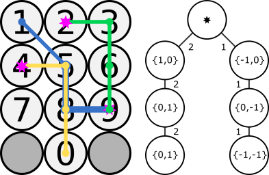

# Jump Mapper
Approximating PIN guess numbers using keypad patterns.

By training a model with an existing breached data set of 4-digit PINs and their frequencies, can we correctly predict the strength of previously unseen PINs using only keypad jumps? Can we extend this to longer PINs without adding any new training data?

## Projects
This repository is a bit of a mixture. It's a Visual Studio solution containing several projects which are outlined below.

### JumpMapper
This is the main event. By modelling PIN entry as a series of 'jumps' the model attempts to predict weaker PINs based on the pattern they form on the keyboard. The model is very simple, the following illustration shows the PINs `2369`, `4580` and `9851` being entered on an ATM-layout PIN pad next to the tree of jumps that is produced by training using these three PINs:



Briefly, use the program like this:

```
./JumpMapper.exe <training_file> <input_file> [format]
```

The options are quite straightforward:

| Option        | Values              | Required? | Description                                               |
|---------------|---------------------|-----------|-----------------------------------------------------------|
| training_file | Any                 | Yes       | The file containing training data.                        |
| input_file    | Any                 | Yes       | The file containing unseen data.                          |
| layout        | `atm/numbar/numpad` | No        | The shape of the PIN pad model to use, defaults to `atm`. |
| format        | `plain/coq`         | No        | The format of output, defaults to `plain`.                |

Results are written to standard output. The `plain` format produced comma-delimited output with headings. The `coq` format option will produce a lookup structure compatible with [the Coq proof assistant](https://coq.inria.fr/).

#### Training
The program accepts semicolon/newline delimited files in the format:

```
pin1;frequency1
pin2;frequency2
pin3;frequency3
...
```


One such file can be found [here](http://jemore.free.fr/wordpress/?p=73&t=most-common-pin-numbers-complete-list). If only four-digit PINs are provided as training data, unseen data should be limited to 4-digit PINS only or there'll be errors. Here's a sample:

```
1234;255
1111;244
0000;221
1212;212
7777;203
...
```

#### Unseen Data
Unseen data is provided as a text file with one PIN per line:

```
0000
0001
0002
0003
0004
0005
0006
0007
0008
0009
0010
...
```

#### Output
Output is produced in the following `plain` format. Higher `vulnerability` means the PIN is a worse choice.

```
pin, vulnerability
0000, 118409
0001, 116563
0002, 116529
0003, 116521
0004, 116715
0005, 116817
...
```

#### The Example
The `/example` directory contains three files:

- `target.txt` represents the target of the attack. Imagine this is a database of passwords waiting to be attacked. This has been generated by "rehydrating" [this file](http://jemore.free.fr/wordpress/?p=73&t=most-common-pin-numbers-complete-list) using [Count Expander](https://github.com/sr-lab/count-expander), shuffling randomly and taking half the entries.
- `random.txt` is a randomly generated set of 100 4-digit guesses.
- `generated.txt` is a set of the 100 most likely 4-digit guesses according to the utility when trained on the other half of the data used to produce `target.txt`.

You can test the effectiveness of each of these attacks on `target.txt` using [Guesser](https://github.com/sr-lab/guesser). To save you doing that, however, `random.txt` guesses `5071/485009` correctly while `generated.txt` is more successful with `6060/485009` correct guesses (about 20% more effective).

### JumpMapper.AscendingPinGenerator
This simple utility just generates PINs of a certain length in a certain range in ascending order. Use it like so:

```
AscendingPinGenerator [-?] [length=4] [count=100] [start=0]
```

Output is printed to the console. The options are quite straightforward:

| Option        | Values      | Required? | Description                                               |
|---------------|-------------|-----------|-----------------------------------------------------------|
| help          | Flag (`-?`) | No        | Shows usage information.                                  |
| length        | Numeric     | No        | The length of PINs to generate.                           |
| count         | Numeric     | No        | The number of PINs to generate.                           |
| start         | Numeric     | No        | The PIN to start at (without leading zeroes).             |

### JumpMapper.DateFilter
Another simple utility to remove PINs from a file that can be read as dates. Use it like this:

```
DateFilter <in_file>
```

Output is printed to the console. There is only one option:

| Option        | Values      | Required? | Description                                               |
|---------------|-------------|-----------|-----------------------------------------------------------|
| in_file       | Any         | Yes       | The path of the file to load PINs from.                   |

### JumpMapper.PinHarvester
This utility harvests all contiguous numeric substrings from a given newline-delimited password dump file that are of a given length or longer. Use it like this:

```
PinHarvester <in_file> [length=4]
```

Output is printed to the console. Options follow:

| Option        | Values      | Required? | Description                                                                             |
|---------------|-------------|-----------|-----------------------------------------------------------------------------------------|
| in_file       | Any         | Yes       | The path of the file to load passwords from.                                            |
| length        | Numeric     | No        | Continuous numeric substrings of this length or longer will be harvested. Default is 4. |

### JumpMapper.RandomPinGenerator
Generates a specified number of unique random PINs of the specified length. Use it like this:

```
RandomPinGenerator [-?] [length=4] [count=100]
```

Output is printed to the console. options follow:

| Option        | Values      | Required? | Description                                               |
|---------------|-------------|-----------|-----------------------------------------------------------|
| help          | Flag (`-?`) | No        | Shows usage information.                                  |
| length        | Numeric     | No        | The length of PINs to generate.                           |
| count         | Numeric     | No        | The number of PINs to generate.                           |

### JumpMapper.Shared
Just some code shared between all utilities in the project. This is compiled into a seperate DLL, so make sure that stays in the same directory as the built utilities.

## Credits
- PIN numbers sorted by frequency: http://jemore.free.fr/wordpress/?p=73&t=most-common-pin-numbers-complete-list
- Original PIN number frequency analysis: http://www.datagenetics.com/blog/september32012/
